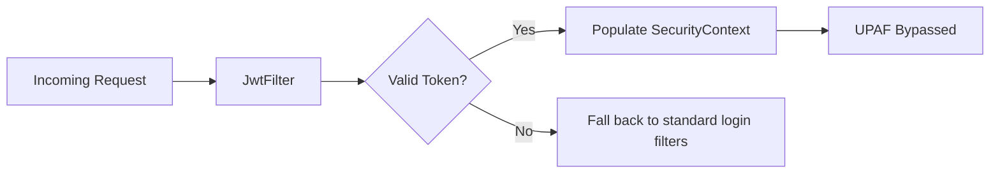

<!-- START doctoc generated TOC please keep comment here to allow auto update -->
<!-- DON'T EDIT THIS SECTION, INSTEAD RE-RUN doctoc TO UPDATE -->
**Table of Contents**  *generated with [DocToc](https://github.com/thlorenz/doctoc)*

- [Distributed Application Security Architectures with Spring Security](#distributed-application-security-architectures-with-spring-security)
  - [1. Core Principles: CSRF & Stateless Design](#1-core-principles-csrf--stateless-design)
    - [Cross-Site Request Forgery (CSRF) Mechanics](#cross-site-request-forgery-csrf-mechanics)
  - [2. Overriding Default Spring Security Filters](#2-overriding-default-spring-security-filters)
    - [Key Filter Configurations](#key-filter-configurations)
  - [3. Custom Authentication Architecture](#3-custom-authentication-architecture)
    - [Architectural Pipeline](#architectural-pipeline)
  - [4. Cryptographic Hashing with BCrypt](#4-cryptographic-hashing-with-bcrypt)
  - [5. Tokenization: JWT Framework Integration](#5-tokenization-jwt-framework-integration)
    - [Structure of a Token (`header.payload.signature`)](#structure-of-a-token-headerpayloadsignature)
  - [6. Token Invalidation and Interception Filtering](#6-token-invalidation-and-interception-filtering)
    - [Authentication Execution Chain](#authentication-execution-chain)

<!-- END doctoc generated TOC please keep comment here to allow auto update -->

# Distributed Application Security Architectures with Spring Security

A production-ready reference log documenting the architectural shift from stateful session management to stateless, cryptographically hardened JSON Web Token (JWT) structures.

---

## 1. Core Principles: CSRF & Stateless Design

### Cross-Site Request Forgery (CSRF) Mechanics
* **Vulnerability:** Attacks target stateful systems leveraging browser-managed cookies. The browser automatically appends authentication cookies to cross-domain requests without validating user intent.
* **Mitigation:** Cryptographically random, unpredictable Anti-CSRF Tokens mapped directly to individual active user sessions.
* **API Implementation:** Exposing a token endpoint (`/csrf-token`) allows stateless programmatic clients (e.g., Postman, SPAs) to capture the verification payload and include it within incoming `X-CSRF-TOKEN` HTTP headers.

```java
@GetMapping("/csrf-token")
public CsrfToken getCsrfToken(HttpServletRequest request) {
    return (CsrfToken) request.getAttribute("_csrf");
}
```

## 2. Overriding Default Spring Security Filters

The custom configuration explicitly overrides default Spring Security patterns, positioning custom network interceptors ahead of the `DispatcherServlet`.

### Key Filter Configurations

- `csrf().disable()`: Relinquishes cookie-based token validation. Safe for stateless, cookie-less REST APIs.
- `SessionCreationPolicy.STATELESS`: Suppresses the instantiation of `HttpSession` records inside Tomcat memory. Every transaction requires standalone credentials.
- `httpBasic() / formLogin()` Context:Standard HTTP Basic prompts browser-native alert wrappers (Base64 credential maps) suited for system integrations, while traditional Form-based architectures demand continuous user sessions.

```java
@Configuration
@EnableWebSecurity
public class SecurityConfig {

    @Autowired
    private JwtFilter jwtFilter;

    @Bean
    public SecurityFilterChain securityFilterChain(HttpSecurity http) throws Exception {
        return http
            .csrf(AbstractHttpConfigurer::disable)
            .authorizeHttpRequests(request -> request
                .requestMatchers("/register", "/login").permitAll()
                .anyRequest().authenticated())
            .sessionManagement(session -> session.sessionCreationPolicy(SessionCreationPolicy.STATELESS))
            .addFilterBefore(jwtFilter, UsernamePasswordAuthenticationFilter.class)
            .build();
    }
}
```

## 3. Custom Authentication Architecture

To shift away from memory-locked properties configurations, a concrete relational database schema was implemented using PostgreSQL 18 (Port 5432) mapped to the database environment (amitkapila).

### Architectural Pipeline

0. `UserDetailsService`: Implemented via `MyUserDetailsService` to query the underlying relational repository (`UserRepo`) by an isolated field string matching property mappings (`findByUsername`).
1. `UserDetails` Wrapper: Concrete domains (`Users`) are injected into custom security adapters (`UserPrincipal`) conforming strictly to framework principal schemas.
2. `DaoAuthenticationProvider`: Evaluates custom principal models using localized password encoding strategies.

```java
@Bean
public AuthenticationProvider authenticationProvider(MyUserDetailsService myUserDetailsService) {
    DaoAuthenticationProvider provider = new DaoAuthenticationProvider();
    provider.setUserDetailsService(myUserDetailsService);
    provider.setPasswordEncoder(new BCryptPasswordEncoder(12));
    return provider;
}
```

## 4. Cryptographic Hashing with BCrypt

Storing credentials in plaintext poses significant risk. To decouple the system from fragile encryption keys, cryptographic hashing with an active computational workload factor (cost = 12) was applied.
- Salting Mechanics: Introduces an unpredictable noise suffix to input data streams, entirely preventing collision attacks and lookup exploits via Rainbow Tables.
- Key Stretching: Intentionally strains local system memory processing speeds to dynamically nullify horizontal brute-force exploits.

```java
public class UserService {
    @Autowired private UserRepo userRepo;
    private BCryptPasswordEncoder encoder = new BCryptPasswordEncoder(12);

    public Users register(Users user) {
        user.setPassword(encoder.encode(user.getPassword()));
        return userRepo.save(user);
    }
}
```

## 5. Tokenization: JWT Framework Integration

To scale horizontally across microservices where central session books cannot operate, standard identity structures are encapsulated inside self-contained JSON Web Tokens (JWT).

### Structure of a Token (`header.payload.signature`)
- **Header**: Specifies target cryptographic operations (e.g., `HS256` symmetric signing).
- **Payload**: Open, unencrypted JSON properties containing access attributes ("Claims") such as Subject (`sub`), Issue Time (`iat`), and Expiration Window (`exp`).
- **Signature**: Formed via computing `HMAC-SHA256` matching constraints using a strong 256-bit runtime cryptokey string (`KeyGenerator`). Confirms data immutability.

```java
@Service
public class JWTService {
    private String secretKey;

    public JWTService() {
        try {
            KeyGenerator keyGen = KeyGenerator.getInstance("HmacSHA256");
            secretKey = Base64.getEncoder().encodeToString(keyGen.generateKey().getEncoded());
        } catch (NoSuchAlgorithmException e) {
            throw new RuntimeException(e);
        }
    }

    public String generateToken(String username) {
        return Jwts.builder()
            .subject(username)
            .issuedAt(new Date(System.currentTimeMillis()))
            .expiration(new Date(System.currentTimeMillis() + 1000 * 60 * 60 * 10))
            .signWith(getKey())
            .compact();
    }
}
```

## 6. Token Invalidation and Interception Filtering

Incoming stateless traffic bypasses the traditional `UsernamePasswordAuthenticationFilter` (UPAF) and is captured early by an isolated lifecycle block (`OncePerRequestFilter`).



### Authentication Execution Chain

0. **Extraction**: Isolates the raw string data out of the `Authorization: Bearer <token>` token schema.
1. **Resolution**: Cryptographically parses the incoming claims to evaluate the localized token subject (`extractUsername`).
2. **Context Binding**: If the subject exists and no validation context occupies the current operational thread container (`SecurityContextHolder`), target user records are fetched from database storage.
3. **Elevation**: Instantiates a secure token entity (`UsernamePasswordAuthenticationToken`) and directly forces it into the root security structure context.

```java
@Component
public class JwtFilter extends OncePerRequestFilter {
    @Autowired private JWTService jwtService;
    @Autowired private ApplicationContext context;

    @Override
    protected void doFilterInternal(HttpServletRequest request, HttpServletResponse response, FilterChain filterChain) 
            throws ServletException, IOException {
        String authHeader = request.getHeader("Authorization");
        String token = null;
        String username = null;

        if (authHeader != null && authHeader.startsWith("Bearer ")) {
            token = authHeader.substring(7);
            username = jwtService.extractUsername(token);
        }

        if (username != null && SecurityContextHolder.getContext().getAuthentication() == null) {
            UserDetails userDetails = context.getBean(MyUserDetailsService.class).loadUserByUsername(username);

            if (jwtService.validateToken(token, userDetails)) {
                UsernamePasswordAuthenticationToken authToken = 
                    new UsernamePasswordAuthenticationToken(userDetails, null, userDetails.getAuthorities());
                authToken.setDetails(new WebAuthenticationDetailsSource().buildDetails(request));
                SecurityContextHolder.getContext().setAuthentication(authToken);
            }
        }
        filterChain.doFilter(request, response);
    }
}
```

